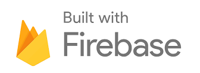
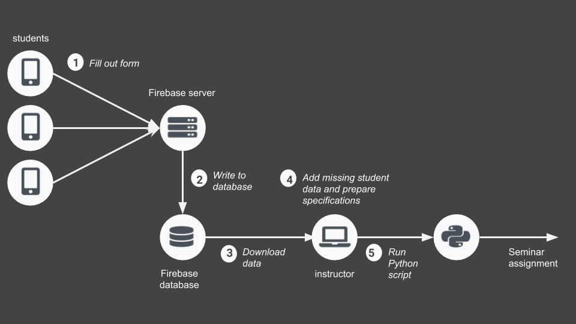

# Documentation: Seminar assignment

[gimmick:theme](journal)


## Background

These seminar assignment tools enable you to collect your students' seminar preferences online and assign seminars automatically. 


## Components

The seminar assignment application consists of a website and real time database hosted by Google Firebase to collect and store students' seminar priorities. Seminars are assigned automatically by a Python application.




## Workflow

1. Students fill out an online form about their seminar preferences. 

2. The Firebase webserver writes the gathered data to a Firebase realtime database. 

3. As an instructor, you can now download the data with your Firebase account.

4. Manually add all missing student data and prepare the specifications for the seminar assignment.

5. By executing the Python script, seminars get assigned automatically.




## Website and database

### Prerequisites

- Firebase account: As the website is hosted by Google Firebase and a realtime Firebase database is used to store the data, you need a [Firebase account](https://firebase.google.com/). 

- npm: To deploy your website, a running version of [npm](https://www.npmjs.com/) is required. Npm is a package manager for JavaScript. 

### Set up your Firebase project and database

1. Log into your firebase account with your credentials.

2. Go to your console and add a project.

3. Go to 'Database' and add a realtime database.

4. Set your database rules to the following parameters:
```javascript
{
    "rules": {
      ".read": false,
      ".write": true
    }
}
```
5. Add your project details to the [forms.js](js/forms.js) file. You will find all relevant values under your project settings.
```javascript
var config = {
    apiKey: "your API key",
    authDomain: "seminarwahl.firebaseapp.com",
    databaseURL: "https://seminarwahl.firebaseio.com",
    projectId: "seminarwahl",
    storageBucket: "seminarwahl.appspot.com",
    messagingSenderId: "your messaging sender id"
    };
```

### Adapt the website to your use case

To add new seminars, you have to change the [index.html](index.html) and [forms.js](js/forms.js) files.

#### index.html

The information for each seminar is contained within a table row. In the first td-element contains the checkbox, the second the seminar title, the third the lecturer info and the last the day of the week and time. 

Optional hyphenation is marked by ```&shy;```.

To insert a new seminar simply copy the code below and add the relevant seminar info. Please note that an unique id ```id="putSomethingUniqueHere"``` needs to be assigned to every seminar.

```
<tr>
   <td style="width: 35px; display: inline-block">
      <span class="dontcare" id="putSomethingUniqueHere"></span>
   </td>
   <td>
      <span class="checkText">
	   Seminar&shy;title
	  </span>
   </td>
   <td>
      <span class="checkText">lecturer</span>
   </td>
   <td>
      <span class="checkText">
         Day of the week and time
      </span>
   </td>
</tr>
```


#### forms.js

The [forms.js](js/forms.js) provides most of the functionality for the website which is why you need to add functionalities for your new seminars here as well. In the [index.html](index.html) file you previously assigned an unique id to your new seminar. To access this seminar you have to use ```$("#putSomethingUniqueHere")```.

To add your new seminars, add/change the following lines:

- Change checkboxes on click.
```javascript
$(document).ready(function() {
   $("#putSomethingUniqueHere").click(toggleClass)
}
```
- Read out and process user data entered into the form. 
```javascript
function submitData(event) {
   prios.push(convertToWeights($('#putSomethingUniqueHere').attr('class')))
}
```
- Write the user data to your server. 
Attention: In this step, it is important at which position you previously added your seminar data, f.e. the data for the first ```prios.push()``` can be found at positon 0 and therefore be accessed by ```prios[0]```. In the case presented below, ```$("#putSomethingUniqueHere")``` was pushed as the fourth element and can therefore be accessed by ```prios[3]```. 
Also note that the string "seminar C" will be the name under which your data will be stored in the database.
```javascript
function writeUserData(userId, stud, email, prios, neededSems, com) {
   "seminar C": prios[3]
}
```

### Deploy your web application

To deploy your web application, take the following steps (if you already deployed your project in the past, you will only need to execute steps 1, 4 and 6):

1. Open the Node.js command prompt and execute the following commands. More information regarding errors in the deployment process can be found [here](https://firebase.google.com/docs/hosting/).

2. Install Firebase (the command also updates your current firebase version)
```javascript
$ npm install -g firebase-tools
```

3. Log into your firebase account with your credentials.
```javascript
$ firebase login
```

4. Navigate to the directory of your project. In the present case, all html, css and js files can be found in the public folder or a subfolder. Replace the path below with your folder structure. 
```javascript
$ cd C:\Users\clarissa\Desktop\seminar_assignment\web\public
```

5. Initialize your firebase project. This command creates a firebase.json configuration file in the root of your project directory.
```javascript
$ firebase init
```

6. Deploy your project and make it available online (or update your project version).
```javascript
$ firebase deploy
```

7. Your project should now be available online.


### Gather and download student data

To collect data regarding seminar priorities, simply share the link to your web application with your students. 

After the period of participation, you can download all data stored in your database.

1. Log in to your google account, access [Firebase](https://firebase.google.com) and go to your console.

2. Select your project and go to Database>Data. This view allows you to see all gathered data.

3. Click on the upper right menu and download the export your data as a JSON.

4. After exporting and saving the data, you can now clear the database for future use by hovering over the root element and clicking 'X'.

5. To add missing students (f.e. if a student does not want to use Google products) or adapt data, you can now edit your JSON file. 

### Temporarily deactivate your website


To temporarily deactivate your website, you have to set the writing rights to your database to False and replace some files in your [public](./) directory.

1. Set writing rights to your database to False.
    - Go to your Firebase console and open Database>Rules.
    - In this view you can edit the database rules. Read should *always* be set to false, as otherwise personal data can be read by everybody. To limit writing access to your database, set write to false.
      ```javascript
      {
        "rules": {
          ".read": false,
          ".write": false
      }
      ```
2. Replace files in your [public](./) directory.
    - Remove your [index.html](index.html) file from the [public](./) repository.
    - Rename [indexInactive.html](indexInactive.html) to "index.html". This file will be shown whenever someone tries to access your website.
    - Deploy your website (see: Deploy your web application).

## Python: Seminar assignment

### Prerequisites

Python 3.x is required. Take a look a the official Python Docs for an installation guide: [Python Setup and Usage](https://docs.python.org/3/using/index.html)

Furthermore, you need to have the following packages installed:
- [pandas](https://pandas.pydata.org/): Pandas is a libary for data analysis.
- [NumPy](http://www.numpy.org/): NumPy is a fundamental package for scientific computing.

### Setup and execution

- To run the application put your exported student data into the [zuteilung-python/data/input](../../zuteilung-python/data/input) folder and name the file [seminarwahl-export.json](../../zuteilung-python/data/input/seminarwahl-export.json). 

- In the same folder, create a file named [specifications.csv](../../zuteilung-python/data/input/specifications.csv) which contains the following info: 

| Example | [specifications.csv](../../zuteilung-python/data/input/specifications.csv) | Notes|
|-----------------|-------------------|-------------------|
| First row       | seminar name`\t`max number of participants | |
| Following rows  | Neurokognitive Poetik`\t`15   | The seminar name needs to be identical to the name used in your database export. |
| Last row        | Empty line        |  |
| File format     | csv               |   Separator: `\t` |
- Run the script "groupselection.py". 

- The script calculates one possible seminar assignment and writes the results to [zuteilung-python/data/results](../../zuteilung-python/data/results). In [results_by_student.csv](../../zuteilung-python/data/results/results_by_student.csv) you will find the data as used internally by the program. This file can be used for error correction and debugging. Additionally warnings regarding conflicts (f.e. if assigned seminars have a low priority) will be printed to the console. 

- The [results_by_seminar_seminarname.csv](../../zuteilung-python/data/results/results_by_seminar_seminarname.csv) files in the [data/results](../../zuteilung-python/data/results) folder contain the solution to the assignment problem. For each seminar, students, student mails and comments are listed.

## License

Distributed under GPLv3 License. See [LICENSE](../../LICENSE) for more information.